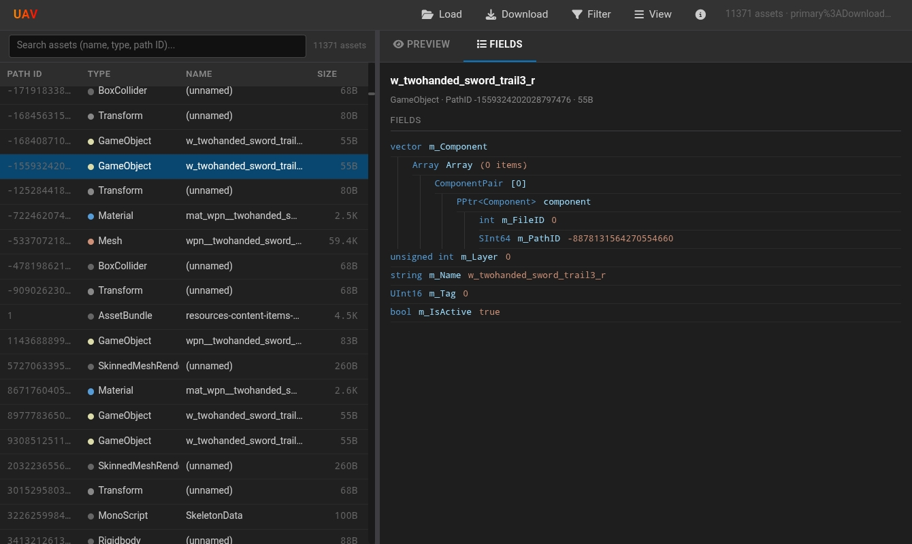
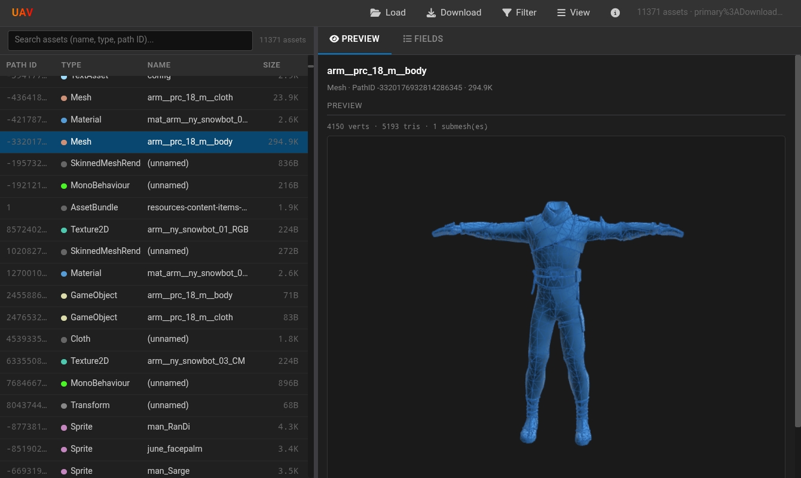
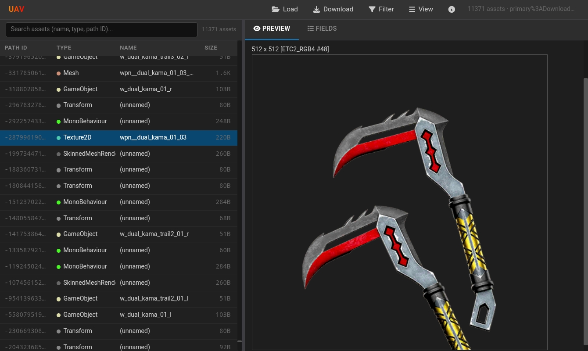

# UAV (Unity Asset Viewer) - Android 


**UAV (Unity Asset Viewer)** is a fast, powerful tool built specifically for **Android** to explore, inspect, and export Unity bundle assets directly on your mobile device. 

Built using .NET 10 MAUI and Blazor, UAV gives you a desktop-grade asset ripping and viewing experience optimized for touch screens, complete with native Android file system integrations.


## Android-First Features

* **Native Storage Access (SAF):** Seamlessly pick `.bundle` or `.assets` files, or grant permission to scan entire directories. UAV integrates deeply with Android's Storage Access Framework to handle files without crashing your device's memory.
* **Direct-to-Downloads Exporting:** Exported assets and `.zip` archives are saved directly to your Android `Downloads` folder automatically—no hunting for hidden app cache folders.
* **Interactive Previews:**
  * **Textures/Sprites:** Decodes compressed Unity texture formats (DXT, BC, ETC, ASTC, etc.) on-device and previews them as standard PNGs.
  * **Meshes:** Fully interactive 3D WebGL preview. Use touch controls to drag, rotate, and zoom Unity Mesh assets right on your phone.
* **Search & Filter:** Quickly find assets by Name, Path ID, or Type. Use quick-toggles to isolate Textures, Meshes, MonoBehaviours, and more.
* **Deep Field Inspector:** Dive into the raw serialized data of any asset with a collapsible JSON-like tree view.
* **Bulk Export:** Export all filtered assets at once into a single `.zip` archive.

## Preview




##  How to Build (GitHub Actions Workflow)

You do **not** need a PC or a local development environment to build the UAV APK. You can build it directly using GitHub Actions!

1. **Fork this repository** to your own GitHub account.
2. Go to the **Actions** tab in your forked repository.
3. If prompted, click **"I understand my workflows, go ahead and enable them"**.
4. On the left sidebar, select the Android Build Workflow (e.g., `Build Android APK`).
5. Click the **Run workflow** dropdown on the right side and click **Run workflow**.
6. Wait for the build process to finish (usually takes a few minutes).
7. Once complete, click on the successful build run, scroll down to **Artifacts**, and download your freshly compiled `UAV.apk`!

### Building Locally (For Developers)
If you want to modify the code and build locally:
1. Ensure you have the [.NET 10 SDK](https://dotnet.microsoft.com/download/dotnet/10.0) installed.
2. Install the MAUI workload: `dotnet workload restore`
3. Run the Android build command:
   ```bash
   dotnet build -t:Run -f net10.0-android

## Credits
* Developer: Nexora

#### UAV stands on the shoulders of giants. A huge thank you to the creators of the following libraries:

* Unity Parsing: AssetsTools.NET by Nesark1
* Texture Decoding: AssetRipper.TextureDecoder
